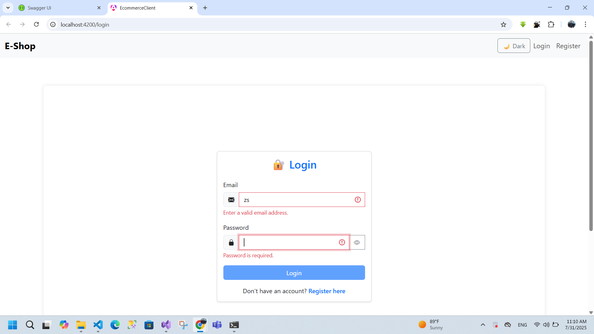
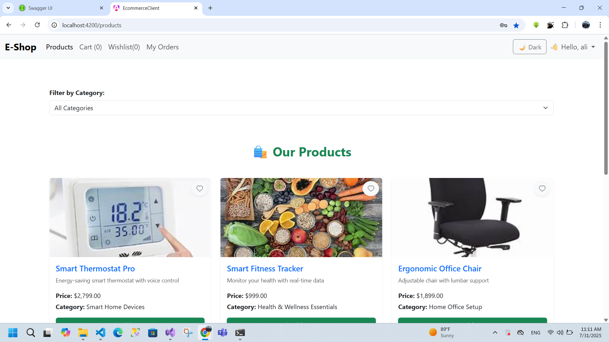
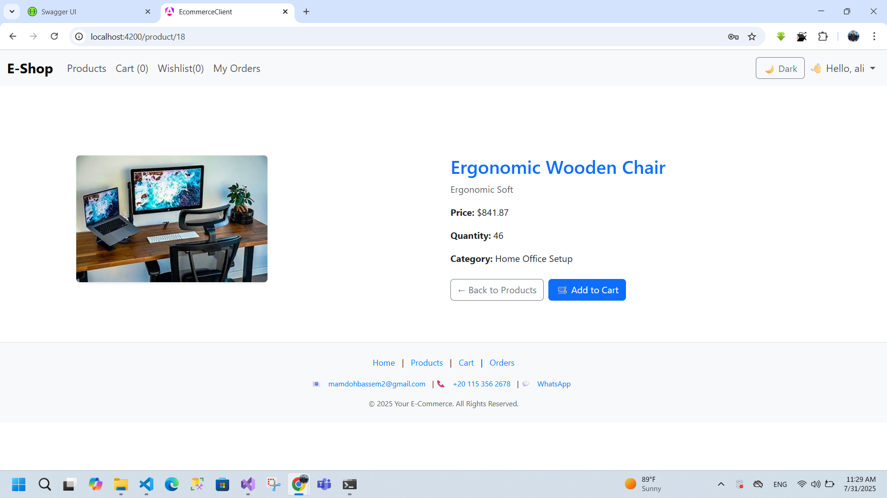
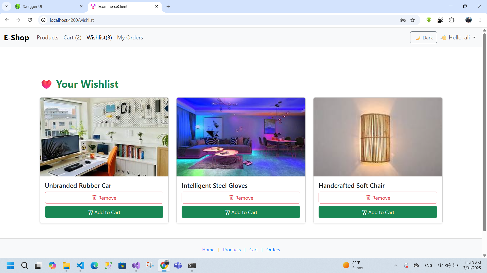
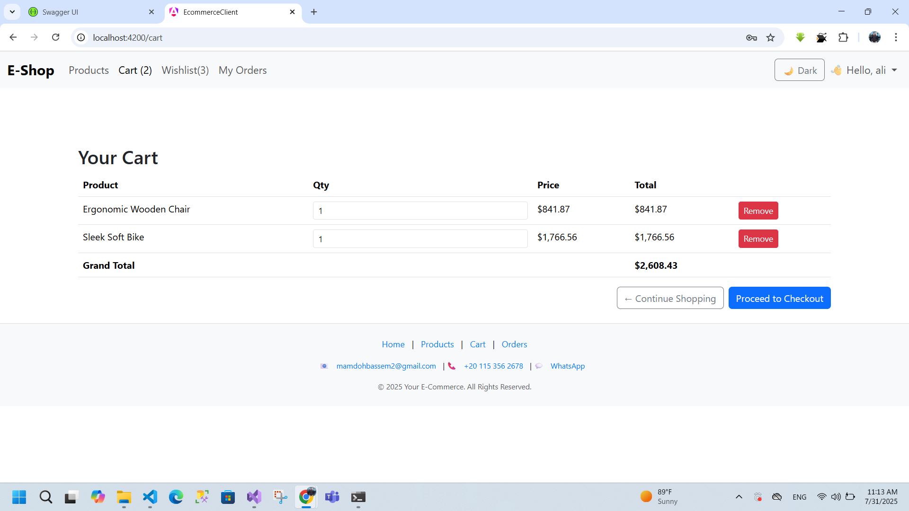
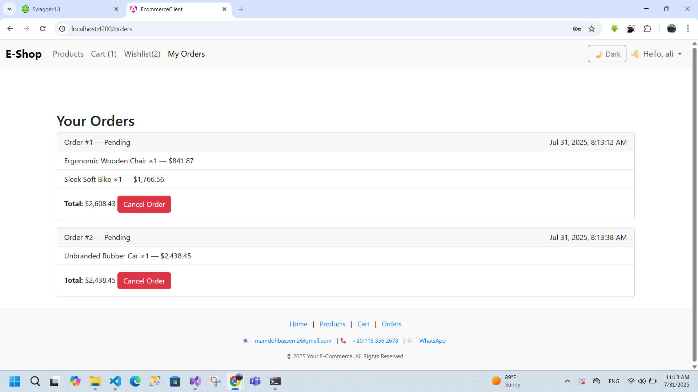
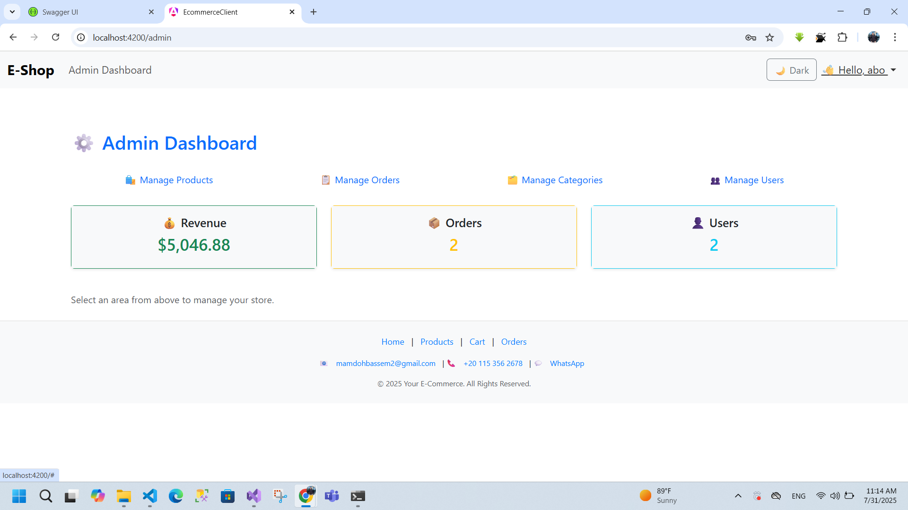
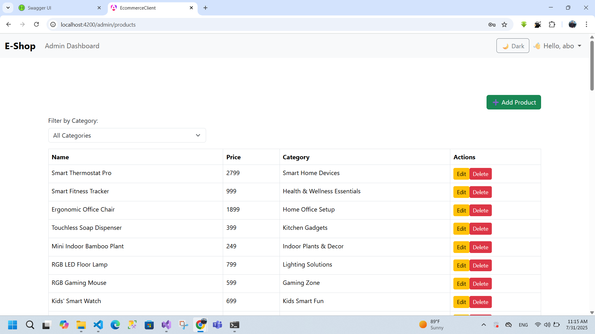
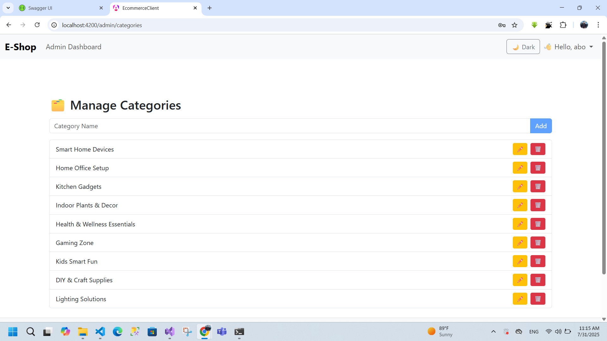
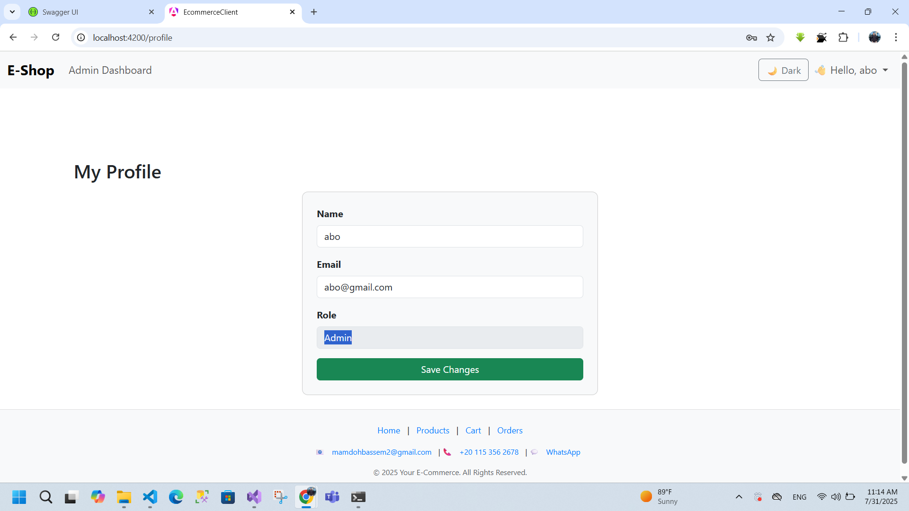

# 🛒 E-Commerce System

A full-stack e-commerce web application built using ASP.NET Core for the backend and Angular for the frontend.

---

## 📸 Screenshots

### 🔐 Login Page

### 🛍️ Product List

### 🔍 Product Details

### ❤️ Wishlist

### 🛒 Cart

### 📦 Orders Page

### 👨‍💼 Admin Dashboard

### 👨‍💼 Admin Product

### 👨‍💼 Admin Category

### 👨‍💼 Admin Users

### 👨‍💼 Admin Profile

---

## 📁 Project Structure
ecommerce-system/
├── ecommerce-client # Angular Frontend
├── ecommerce-server # ASP.NET Core Backend
├── screenshots/ # UI Screenshots
├── .gitignore
├── README.md

---

## 🚀 Getting Started

### 🔧 Backend (.NET Core)

1. Open the solution in **Visual Studio** or **VS Code**
2. Ensure **SQL Server** is running
3. Update the connection string in `appsettings.json` if needed
4. Run database migrations (if needed)
5. Run the project

### 🎨 Frontend (Angular)

cd ecommerce-client
npm install
ng serve
# Then navigate to:
http://localhost:4200/

---
🧪 Features
🛍️ Browse products

🔍 Filter & search

❤️ Wishlist management

🛒 Add to cart

🧾 Place orders

👨‍💼 Admin dashboard (CRUD for products & categories)

🔐 User authentication & authorization

📦 Order tracking (for customers)

📊 Order management (for admin)
--- */-*

🛠️ Tech Stack
Frontend

Angular

TypeScript

Bootstrap

Backend

ASP.NET Core

Entity Framework Core

Database
SQL Server

Tools

Postman

Visual Studio

Git & GitHub

---
## 📬 Contact

For any questions or feedback, feel free to reach out:

- **👤 Name:** Abo Elhassan M. Essa  
- **📧 Email:** [mamdohbassem@gmail.com](mailto:mamdohbassem@gmail.com)  
- **🔗 GitHub:** [AboElhassan-Developer](https://github.com/AboElhassan-Developer)

